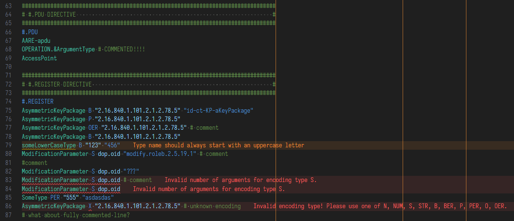

# Wireshark Asn2wrs Conformance Language Server

[whiskeyo](https://github.com/whiskeyo/)'s Wireshark Asn2Wrs Conformance Language Server is developed to make working with `*.cnf` files way easier. The language itself contains lots of directives and provides:

- intuitive syntax highlighting based on Text Mate grammar,
- documented directives based on official [Wireshark Developer's Guide](https://www.wireshark.org/docs/wsdg_html_chunked/index.html),
- snippets to speed up coding.



## Development specific to VS Code

Run this command from the root of the repository:

```bash
npm install
code .
```

After VS Code is started, press the <kbd>Ctrl</kbd>+<kbd>Shift</kbd>+<kbd>B</kbd> to build the extension. Then switch to _Run and Debug_ view and press _Launch Client_, or simply press <kbd>F5</kbd> - it will open the _[Extension Development Host]_ VS Code window. Now, editing any `*.cnf` file inside that window will be affected by any changes that are made to the extension. Edits made in the `server` directory will be rebuilt automatically, but to see their effect, restart the _[Extension Development Host]_ window, either by pressing the Refresh key (🔃) or by the keyboard shortcut <kbd>Ctrl</kbd>+<kbd>Shift</kbd>+<kbd>F5</kbd>.

## Implementation is still missing these things

- full syntax highlighting,
- good LSP,
- and way more, since it's the starting project.
